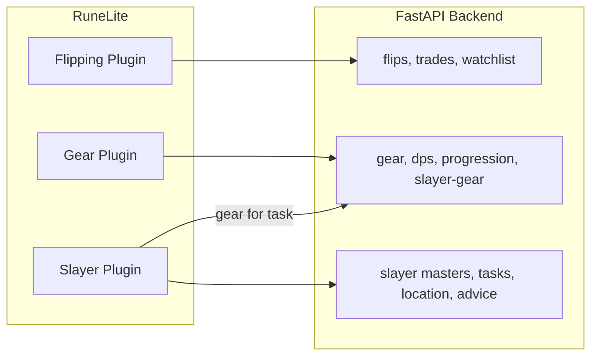

# RuneLite Plugin Analysis for OSRS Tool Hub

**Tech stack correction:** Your frontend is **React 18 + Vite** (not Next.js), per [docs/ARCHITECTURE.md](docs/ARCHITECTURE.md) and [frontend/package.json](frontend/package.json). The backend is FastAPI/Python as stated.

---

## Feature 1: Flipping (GE Scanner, Trades, Watchlist, Alerts)

### 1.1 Current functionality

**Backend** ([backend/api/v1/](backend/api/v1/)):

- **Flips**: `GET /flips/opportunities` — filters `max_budget`, `min_roi`, `min_volume`; returns `FlipOpportunity[]` (item_id, name, buy/sell price, profit, roi, volume, limit).
- **Trades**: `POST /trades`, `GET /trades`, `GET /trades/stats` — log buy/sell, list history (user_id, status, item_id, dates), aggregate stats (total_profit, profit_per_hour, best_items).
- **Watchlist**: `POST /watchlist`, `GET /watchlist`, `DELETE /watchlist/{id}`, `GET /watchlist/alerts` — add items with alert_type (price_below, price_above, margin_above) and threshold; fetch triggered alerts. **Frontend** ([frontend/src/features/flipping/](frontend/src/features/flipping/)):

- **FlippingPage**: Tabs — (1) **Opportunities**: FiltersBar (budget, ROI, volume) → useFlips → ResultsTable; (2) **Profit Tracker**: TradeLogForm, TradeStats, TradeHistory; (3) **Watchlist**: WatchlistManager (add/remove items, thresholds); (4) **Alerts**: AlertNotifications.
- User ID from localStorage (`osrs_tool_hub_user_id`); all trade/watchlist calls require `user_id`.

### 1.2 RuneLite mapping

| Component | Role |

|-----------|------|

| **Plugin** | `OsrsToolHubFlippingPlugin` — lifecycle, Config, HTTP client, optional scheduled poll for opportunities/alerts. |

| **Config** | API base URL, user ID (or “sync with account” later), max_budget/min_roi/min_volume defaults, poll interval, “notify on watchlist alert” (on/off). |

| **Panel** | Main UI: filter inputs, list of flip opportunities (item name, buy/sell, profit, ROI); sub-views or tabs for Trade Log (form + history + stats), Watchlist (add/remove, thresholds), Alerts list. |

| **Overlay** | Optional: small on-screen list of “top 3 flips” or single line “Next flip: X”. Optional: notification when a watchlist alert fires (e.g. “Item Y hit threshold”). |

### 1.3 Data to sync with FastAPI

| Data | Direction | Endpoints |

|------|-----------|------------|

| Flip opportunities | Backend → Plugin | `GET /api/v1/flips/opportunities?max_budget=&min_roi=&min_volume=` |

| Trades | Both | `POST /api/v1/trades`, `GET /api/v1/trades?user_id=`, `GET /api/v1/trades/stats?user_id=&days=` |

| Watchlist | Both | `GET /api/v1/watchlist?user_id=`, `POST /api/v1/watchlist`, `DELETE /api/v1/watchlist/{id}?user_id=` |

| Alerts | Backend → Plugin | `GET /api/v1/watchlist/alerts?user_id=&limit=` |

User identity: keep `user_id` in plugin config (or later from RuneLite account). No new backend endpoints required.

### 1.4 Plugin recommendation

**One plugin** for all flipping: Scanner, Trade Log, Watchlist, and Alerts are one cohesive “GE / flipping” workflow. Single config (API URL, user_id, filters) and one panel with sections/tabs.

---

## Feature 2: Gear (DPS, Loadouts, Progression, Slayer Gear)

### 2.1 Current functionality

**Backend** ([backend/api/v1/gear/](backend/api/v1/gear/)):

- **DPS**: `POST /dps/compare` — multiple loadouts + combat_style, attack_type, player_stats, optional target_monster; returns DPS, max_hit, accuracy, attack_speed, marginal_dps_gain.
- **Items**: `GET /gear/items/{item_id}` — single item with price, stats, requirements.
- **Suggestions / alternatives**: `GET /gear/suggestions?slot=&style=&defence_level=`, `GET /gear/alternatives?slot=&combat_style=&budget=&...stats` — slot-based suggestions.
- **Loadouts**: `GET /gear/preset?combat_style=&tier=`, `POST /gear/best-loadout`, `POST /gear/upgrade-path` — preset/best/upgrade by budget and stats.
- **Slayer gear**: `POST /gear/slayer-gear` — task_id, stats, budget, combat_style, quests, ironman → tier loadouts + primary loadout.
- **Progression**: `GET /gear/progression/{style}`, `GET /gear/progression/{style}/{slot}`, `GET /gear/wiki-progression/{style}`, `POST /gear/global-upgrade-path` — wiki-style tiers and global upgrade path.
- **Gear sets**: `POST /gear`, `GET /gear`, `GET /gear/{id}`, `DELETE /gear/{id}` — CRUD for named loadouts (no user_id in current schema; could be extended).

**Frontend** ([frontend/src/features/gear/](frontend/src/features/gear/)):

- **Gear**: Tabs — Wiki Table (WikiGearTable), Detailed (ProgressionViewer), DPS Lab (DPSLab: LoadoutBuilder, DPSComparisonTable, MarginalGainAnalysis).
- Loadouts are slot → item_id maps; DPS Lab sends multiple loadouts to `/dps/compare`. Progression and wiki table use `/gear/progression/{style}` and related.

### 2.2 RuneLite mapping

| Component | Role |

|-----------|------|

| **Plugin** | `OsrsToolHubGearPlugin` — Config, HTTP client; optionally read equipped items from game (RuneLite ItemManager) to pre-fill “current loadout”. |

| **Config** | API base URL, default combat_style (melee/ranged/magic), default attack_type, “auto-fill from worn” (yes/no), “show DPS overlay” (yes/no). |

| **Panel** | (1) **Loadout builder**: slot grid, pick item per slot (call suggestions/alternatives or item search); (2) **DPS compare**: 2+ loadouts, “Compare” → `/dps/compare` → table (DPS, max hit, accuracy, marginal gain); (3) **Progression**: style selector → progression tree or wiki-style table; (4) optional **Best loadout / Upgrade path**: budget + stats → best or next upgrade. |

| **Overlay** | Optional: show “Current DPS” or “Next upgrade: Slot X – Item Y” from last comparison or upgrade-path result. |

### 2.3 Data to sync with FastAPI

| Data | Direction | Endpoints |

|------|-----------|------------|

| DPS comparison | Plugin → Backend | `POST /api/v1/dps/compare` (loadouts, combat_style, attack_type, player_stats, target_monster) |

| Item details | Backend → Plugin | `GET /api/v1/gear/items/{item_id}` |

| Suggestions / alternatives | Backend → Plugin | `GET /api/v1/gear/suggestions`, `GET /api/v1/gear/alternatives` |

| Preset / best / upgrade | Backend → Plugin | `GET /api/v1/gear/preset`, `POST /api/v1/gear/best-loadout`, `POST /api/v1/gear/upgrade-path` |

| Slayer gear | Plugin → Backend | `POST /api/v1/gear/slayer-gear` (used when user is on a slayer task in Slayer plugin; see below) |

| Progression | Backend → Plugin | `GET /api/v1/gear/progression/{style}`, `GET /api/v1/gear/wiki-progression/{style}`, `POST /api/v1/gear/global-upgrade-path` |

| Gear sets | Both (if user-bound) | Current `POST/GET/DELETE /gear`; backend would need optional user_id for per-account sets. |

### 2.4 Plugin recommendation

**One plugin** for Gear: DPS Lab, loadout builder, progression, and “best/upgrade” are one “gear optimisation” surface. Optional overlay for current DPS or next upgrade. Slayer-specific gear can be triggered from the Slayer plugin (e.g. “Suggest gear for this task” → call `/gear/slayer-gear`).

---

## Feature 3: Slayer (Tasks, Advice, Locations, Monster DB, Gear Suggestions)

### 3.1 Current functionality

**Backend** ([backend/api/v1/slayer.py](backend/api/v1/slayer.py)):

- **Masters**: `GET /slayer/masters` → list of master names.
- **Tasks**: `GET /slayer/tasks/{master}` → `SlayerTask[]` (task_id, monster_name, category, amount, weight, combat_level, slayer_xp, is_skippable, is_blockable).
- **Location**: `GET /slayer/location/{task_id}` → locations, requirements, multi/safespot/cannon, pros/cons, strategy, weakness, items_needed.
- **Advice**: `GET /slayer/advice/{task_id}?slayer_level=&combat_level=` → DO/SKIP/BLOCK + reason, stats, meta (xp_rate, profit_rate, attack_style, items_needed, weakness).

**Frontend** ([frontend/src/features/slayer/](frontend/src/features/slayer/)):

- **SlayerPage**: Tabs — (1) **Task Helper**: MasterSelector → TaskGrid (task cards) → click “Advice” → AdviceModal (recommendation, reason, meta); TaskCard can open location/strategy; (2) **Monster Database**: MonsterDatabase (browse/search).
- **SlayerGearSuggestions** (in AdviceModal or task detail): stats, budget, combat style, ironman → `GearApi.getSlayerGear(task_id, ...)` → tier loadouts and primary loadout.

### 3.2 RuneLite mapping

| Component | Role |

|-----------|------|

| **Plugin** | `OsrsToolHubSlayerPlugin` — Config, HTTP client; optionally read current task from game (RuneLite SlayerPlugin or VarClient) so overlay/panel can show advice for “current” task. |

| **Config** | API base URL, slayer_level, combat_level (or “read from game” if RuneLite exposes them), “show overlay” (yes/no), “overlay shows” (advice only / advice + location / full). |

| **Panel** | (1) Master → task list (same as web); (2) Click task → advice (DO/SKIP/BLOCK + reason), location summary, strategy, weaknesses; (3) “Gear for this task” button → call Gear API `POST /gear/slayer-gear` and show loadouts; (4) Monster database (search/browse). |

| **Overlay** | High value: show current task name + **DO / SKIP / BLOCK** + one-line reason; optional: location name, “Gear: Melee” or best location. All driven by `/slayer/advice/{task_id}` and optionally `/slayer/location/{task_id}`. |

### 3.3 Data to sync with FastAPI

| Data | Direction | Endpoints |

|------|-----------|------------|

| Masters | Backend → Plugin | `GET /api/v1/slayer/masters` |

| Tasks | Backend → Plugin | `GET /api/v1/slayer/tasks/{master}` |

| Location | Backend → Plugin | `GET /api/v1/slayer/location/{task_id}` |

| Advice | Backend → Plugin | `GET /api/v1/slayer/advice/{task_id}?slayer_level=&combat_level=` |

| Slayer gear | Plugin → Backend | `POST /api/v1/gear/slayer-gear` (same as Gear; used from Slayer panel when user asks for gear for a task) |

Player stats: either from config (slayer_level, combat_level) or from RuneLite (Skill levels, Combat level) when available.

### 3.4 Plugin recommendation

**One plugin** for Slayer: task list, advice, location, and “gear for task” in one place. Overlay is the main differentiator (in-game DO/SKIP/BLOCK at a glance). Gear suggestions stay in Gear API; Slayer plugin only calls it when user requests “gear for this task”.

---

## One plugin vs multiple plugins — recommendation

**Recommendation: three separate RuneLite plugins.**

| Plugin | Scope | Rationale |

|--------|--------|-----------|

| **OSRS Tool Hub – Flipping** | Flips, trades, watchlist, alerts | Single “GE / flipping” workflow; one config (API URL, user_id); overlay optional. |

| **OSRS Tool Hub – Gear** | DPS, loadouts, progression, suggestions, best/upgrade/slayer-gear | Single “gear optimisation” workflow; optional overlay (DPS or next upgrade). |

| **OSRS Tool Hub – Slayer** | Masters, tasks, location, advice + “Gear for task” (calls Gear API) | Task/advice/location + overlay; gear is “suggest gear” action that calls existing backend. |

Reasons:

1. **Audience** — Flipping (merchants), Gear (PvM/gearing), Slayer (task-focused) can adopt one plugin without pulling in the others.
2. **Overlay value** — Slayer overlay (DO/SKIP/BLOCK + location) is high; Flipping overlay is low (notifications or top flips); Gear overlay is optional (DPS/upgrade). Separate plugins keep each overlay scope clear.
3. **Maintenance** — Smaller, focused codebases; you can version and release independently (e.g. fix Slayer overlay without touching Flipping).
4. **Backend** — No change: same FastAPI routes; optional shared Java “API client” library or config (base URL) duplicated in each plugin.

Alternative: **One “OSRS Tool Hub” plugin** with three panels (Flipping, Gear, Slayer) and one shared config (API URL, user_id). Preferable only if you want a single install and a single entry in the RuneLite plugin list; overlay behaviour would still be per-feature (Slayer overlay on, Flipping overlay optional, etc.).

---

## Summary diagram

---

## Backend considerations for RuneLite

- **CORS**: If plugins call API from a non-browser client (Java), CORS is irrelevant; if you ever add a browser-based RuneLite companion, you’d need CORS on FastAPI.
- **Rate limiting**: Existing per-IP limits ([backend/app/middleware.py](backend/app/middleware.py)) apply; plugin traffic is just another client. Optional: API key or user_id in header for higher limits.
- **Auth**: Current `user_id` (query/body) is enough for Flipping (trades, watchlist). Gear sets currently have no user_id; add optional `user_id` (or RuneLite account id) to gear sets if you want per-account loadouts.
- **Contracts**: Keep existing request/response shapes; RuneLite plugins should use the same [backend API routes and schemas](backend/api/v1/) so the web app and plugins stay in sync.